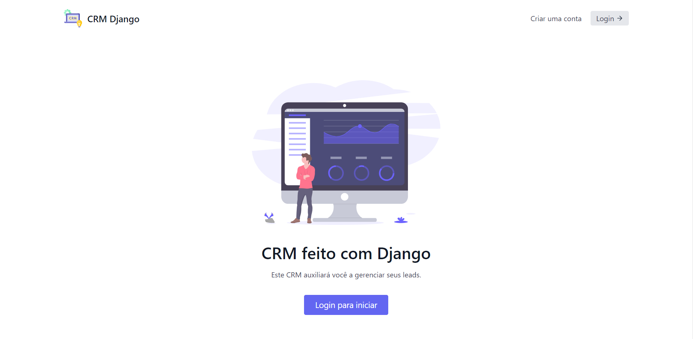
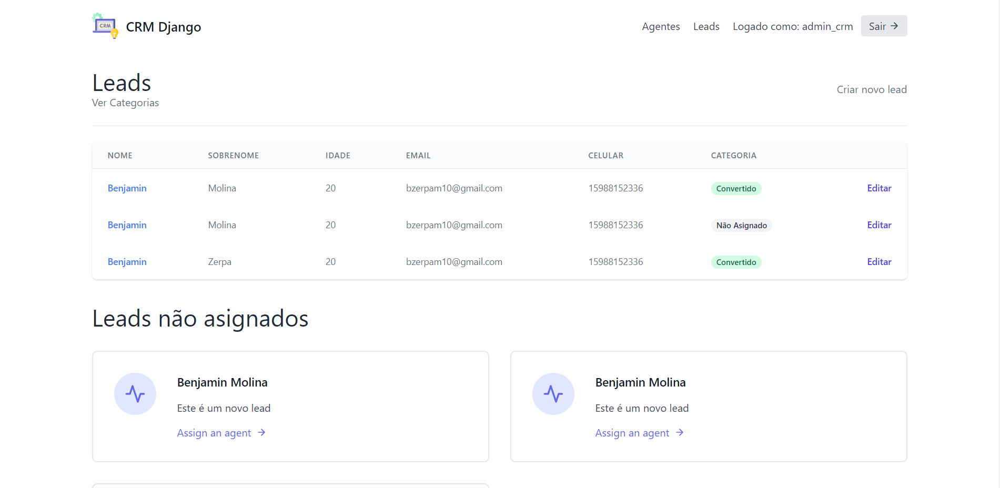

# CRM feito em Django

Este é um repositório contendo um projeto de CRM (Customer Relationship Management) construído com o framework web Django. O objetivo deste projeto é gerenciar clientes e suas informações, incluindo dados de contato, histórico de compras e notas sobre as interações.

## Funcionalidades

- Cadastro, visualização, edição e exclusão de clientes;
- Registro de interações com os clientes;
- Visualização do histórico de compras de cada cliente;
- Anotações sobre cada cliente.

## Imagens do projeto

A seguir, algumas imagens mostrando como o projeto funciona:

## Instalação

Para instalar o projeto, siga os seguintes passos:

1. Clone o repositório para sua máquina local.
2. Crie um ambiente virtual para o projeto.
3. Instale as dependências com `pip install -r requirements.txt`.
4. Crie o banco de dados com `python manage.py migrate`.
5. Crie um superusuário com `python manage.py createsuperuser`.
6. Inicie o servidor com `python manage.py runserver`.
7. Acesse o projeto no navegador em `http://localhost:8000/`.

## Contribuição

Contribuições são bem-vindas! Para contribuir com o projeto, siga os seguintes passos:

1. Crie um fork deste repositório.
2. Crie uma branch para sua contribuição: `git checkout -b minha-contribuicao`.
3. Faça suas alterações e commit.
4. Faça push para o seu fork: `git push origin minha-contribuicao`.
5. Abra um Pull Request para este repositório. 

## Licença

Este projeto está licenciado sob a Licença MIT - veja o arquivo [LICENSE.md](LICENSE.md) para mais detalhes.
